# io_uring Safety Diagrams

**Professional diagrams using Mermaid (renders natively on GitHub)**

---

## The Problem: Borrowed Buffers Are Unsafe

### ❌ Unsafe Pattern with Borrowed Buffers

```mermaid
sequenceDiagram
    participant User
    participant Runtime as io_uring Runtime
    participant Kernel
    
    User->>User: let mut buffer = vec![0u8; 1024]
    User->>Runtime: io_uring.read(&mut buffer)
    Note over User,Runtime: Buffer BORROWED (user still has access)
    Runtime->>Kernel: Submit read with buffer ptr
    
    par User continues
        User->>User: buffer[0] = 42
        Note over User: ⚠️ DATA RACE!
    and Kernel operates
        Kernel->>Kernel: Writing to buffer
        Note over Kernel: ⚠️ Concurrent write!
    end
    
    Kernel-->>Runtime: Complete
    Runtime-->>User: Operation done
    Note over User,Kernel: ❌ UNDEFINED BEHAVIOR (data race occurred)
```

---

## The Solution: Owned Buffer Transfer

### ✅ Safe Pattern with Owned Buffers

```mermaid
sequenceDiagram
    participant User
    participant Compio as Compio Runtime
    participant Heap as Heap (RawOp)
    participant Kernel
    
    User->>User: let buffer = vec![0u8; 1024]
    User->>Compio: file.read_at(buffer, 0)
    Note over User,Compio: Buffer MOVED (ownership transferred)
    Compio->>Heap: Box::new(RawOp { op: ReadAt { buffer } })
    Note over Heap: Buffer stored on HEAP
    Heap->>Kernel: Submit with buffer ptr
    
    Note over User: ✅ Cannot access buffer<br/>(moved away)
    
    Kernel->>Kernel: Read into buffer
    Note over Kernel: ✅ Exclusive access
    
    Kernel-->>Heap: Complete
    Heap-->>Compio: Completion entry
    Compio-->>User: (result, buffer)
    Note over User: ✅ Ownership returned<br/>Safe to access again
```

---

## Cancellation Safety Flow

### What Happens When Future is Dropped

```mermaid
sequenceDiagram
    participant User
    participant Future as OpFuture
    participant Heap as Heap (RawOp)
    participant Driver
    participant Kernel
    
    User->>Future: let fut = file.read_at(buffer, 0)
    Future->>Heap: Box::new(RawOp { buffer })
    Note over Heap: Buffer on HEAP
    Heap->>Kernel: Submit io_uring op
    
    Note over Kernel: Operation in progress...
    
    User->>Future: drop(fut)
    Note over User,Future: Future cancelled!
    Future->>Driver: cancel_op(key)
    Driver->>Heap: cancelled = true
    Driver->>Kernel: Submit AsyncCancel
    Note over Heap: Buffer STILL on heap ✅
    
    Kernel->>Kernel: Complete (original or cancel)
    Kernel-->>Driver: Completion entry
    Driver->>Driver: Check: cancelled == true?
    Driver->>Heap: into_box() - drop RawOp
    Heap->>Heap: Drop ReadAt → Drop Vec<u8>
    Note over Heap: Buffer dropped HERE<br/>✅ SAFE - Kernel done!
```



---

## Buffer Lifecycle States

### State Machine


---

## Safety Comparison

### Implementation Approaches

```mermaid
graph TD
    A[Async Rust + io_uring] --> B{Buffer API Type?}
    
    B -->|Borrowed &mut| C[❌ UNSAFE]
    B -->|Owned + No Tracking| D[❌ UNSAFE on Cancel]
    B -->|Owned + Heap Alloc| E[✅ SAFE - Compio]
    B -->|Owned + Orphan Track| F[✅ SAFE - safer-ring]
    
    C --> C1[Data races possible]
    C --> C2[Use-after-free possible]
    
    D --> D1[Cancellation unsafe]
    D --> D2[Buffer freed too early]
    
    E --> E1[Heap allocation]
    E --> E2[Manual refcount]
    E --> E3[Deferred cleanup]
    
    F --> F1[Explicit orphan tracker]
    F --> F2[Buffer registry]
    
    style C fill:#ff6b6b
    style D fill:#ff6b6b
    style E fill:#51cf66
    style F fill:#51cf66
```



---

## Vec vs BufferPool Safety

### Both Use Same Heap Allocation


---

## Complete Safety Architecture


**Legend**:
- 🟢 Green: Where buffer lives (safely on heap)
- Dotted line: Pointer (Key → RawOp)
- Bold green: Buffer storage location

---

## Further Reading

- [README.md](README.md) - Complete analysis
- [compio-verification.md](compio-verification.md) - Source code evidence  
- [quick-reference.md](quick-reference.md) - Coding patterns

---

**Created**: October 21, 2025  
**Format**: Mermaid diagrams (renders natively on GitHub)  
**Benefit**: Professional appearance, easy to maintain, no alignment issues!

